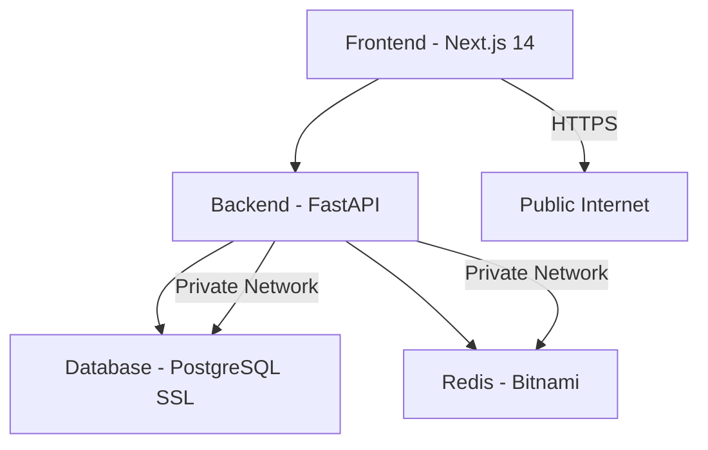

# Railway Template Configuration Guide

Complete reference for all environment variables and services configured in the Railway template.

## Template Overview

**Template Name**: Multi-Tenant SaaS Starter  
**Services**: 4 (Frontend, Backend, Database, Redis)  
**Environment Variables**: 50+ configured  
**Auto-Generated**: Secrets, SSL certificates, service URLs

## Services Architecture



## Frontend Service (Next.js 14)

### Core Configuration

- **Image**: Uses Dockerfile.frontend
- **Port**: Dynamic via `${{RAILWAY_PORT}}`
- **Health Check**: `/api/health`
- **Build**: Nixpacks builder

### Environment Variables

#### Core Settings

| Variable                  | Value                                     | Description            |
| ------------------------- | ----------------------------------------- | ---------------------- |
| `NODE_ENV`                | `production`                              | Node.js environment    |
| `NEXT_PUBLIC_API_URL`     | `https://${{backend.RAILWAY_STATIC_URL}}` | Backend API URL        |
| `NEXT_PUBLIC_APP_NAME`    | `SaaS Starter`                            | Application name       |
| `NEXT_PUBLIC_APP_VERSION` | `1.0.0`                                   | Application version    |
| `NEXT_PUBLIC_ENVIRONMENT` | `production`                              | Environment identifier |

#### Feature Flags

| Variable                       | Default | Description             |
| ------------------------------ | ------- | ----------------------- |
| `NEXT_PUBLIC_ENABLE_BILLING`   | `true`  | Enable billing features |
| `NEXT_PUBLIC_ENABLE_OAUTH`     | `true`  | Enable OAuth login      |
| `NEXT_PUBLIC_ENABLE_ANALYTICS` | `false` | Enable analytics        |
| `NEXT_PUBLIC_ENABLE_CHAT`      | `false` | Enable chat features    |

#### reCAPTCHA Configuration

| Variable                          | Default | Description        |
| --------------------------------- | ------- | ------------------ |
| `NEXT_PUBLIC_RECAPTCHA_ENABLED`   | `true`  | Enable reCAPTCHA   |
| `NEXT_PUBLIC_RECAPTCHA_SITE_KEY`  | `""`    | reCAPTCHA site key |
| `NEXT_PUBLIC_RECAPTCHA_THRESHOLD` | `0.5`   | Score threshold    |

#### Payment Integration

| Variable                             | Default | Description            |
| ------------------------------------ | ------- | ---------------------- |
| `NEXT_PUBLIC_STRIPE_PUBLISHABLE_KEY` | `""`    | Stripe publishable key |

#### OAuth Integration

| Variable                       | Default | Description            |
| ------------------------------ | ------- | ---------------------- |
| `NEXT_PUBLIC_GOOGLE_CLIENT_ID` | `""`    | Google OAuth client ID |

#### Internationalization

| Variable                        | Default    | Description         |
| ------------------------------- | ---------- | ------------------- |
| `NEXT_PUBLIC_DEFAULT_LOCALE`    | `en`       | Default language    |
| `NEXT_PUBLIC_SUPPORTED_LOCALES` | `en,pt,es` | Supported languages |

#### Analytics & Monitoring

| Variable                          | Default | Description           |
| --------------------------------- | ------- | --------------------- |
| `NEXT_PUBLIC_GOOGLE_ANALYTICS_ID` | `""`    | Google Analytics ID   |
| `NEXT_PUBLIC_HOTJAR_ID`           | `""`    | Hotjar tracking ID    |
| `NEXT_PUBLIC_SENTRY_DSN`          | `""`    | Sentry error tracking |

## Backend Service (FastAPI)

### Core Configuration

- **Image**: Uses Dockerfile
- **Command**: `uvicorn api.main:app --host 0.0.0.0 --port $PORT --workers 1`
- **Health Check**: `/health`
- **Restart Policy**: ON_FAILURE (max 3 retries)

### Environment Variables

#### Core Settings

| Variable      | Value               | Description                   |
| ------------- | ------------------- | ----------------------------- |
| `APP_NAME`    | `SaaS Starter`      | Application name              |
| `APP_VERSION` | `1.0.0`             | Application version           |
| `ENVIRONMENT` | `production`        | Environment identifier        |
| `DEBUG`       | `false`             | Debug mode (disabled in prod) |
| `PORT`        | `${{RAILWAY_PORT}}` | Dynamic port                  |

#### Security Configuration

| Variable                      | Value             | Description                   |
| ----------------------------- | ----------------- | ----------------------------- |
| `SECRET_KEY`                  | `${{secret(32)}}` | Auto-generated 32-char secret |
| `JWT_ALGORITHM`               | `HS256`           | JWT signing algorithm         |
| `ACCESS_TOKEN_EXPIRE_MINUTES` | `15`              | Access token TTL              |
| `REFRESH_TOKEN_EXPIRE_DAYS`   | `7`               | Refresh token TTL             |

#### Database & Cache

| Variable       | Value                                                                              | Description           |
| -------------- | ---------------------------------------------------------------------------------- | --------------------- |
| `DATABASE_URL` | `${{database.DATABASE_URL}}`                                                       | PostgreSQL connection |
| `REDIS_URL`    | `redis://default:${{redis.REDIS_PASSWORD}}@${{redis.RAILWAY_PRIVATE_DOMAIN}}:6379` | Redis connection      |

#### CORS Configuration

| Variable          | Value                                      | Description          |
| ----------------- | ------------------------------------------ | -------------------- |
| `ALLOWED_ORIGINS` | `https://${{frontend.RAILWAY_STATIC_URL}}` | Allowed CORS origins |

#### OAuth Providers

| Variable               | Default | Description                |
| ---------------------- | ------- | -------------------------- |
| `GOOGLE_CLIENT_ID`     | `""`    | Google OAuth client ID     |
| `GOOGLE_CLIENT_SECRET` | `""`    | Google OAuth client secret |

#### reCAPTCHA Security

| Variable                 | Default        | Description                 |
| ------------------------ | -------------- | --------------------------- |
| `RECAPTCHA_ENABLED`      | `true`         | Enable reCAPTCHA validation |
| `RECAPTCHA_SITE_KEY`     | `""`           | reCAPTCHA site key          |
| `RECAPTCHA_SECRET_KEY`   | `""`           | reCAPTCHA secret key        |
| `RECAPTCHA_THRESHOLD`    | `0.5`          | Minimum score threshold     |
| `RECAPTCHA_VERIFY_URL`   | Google API URL | Verification endpoint       |
| `TEST_RECAPTCHA_ENABLED` | `""`           | Test override               |

#### Payment Processing

| Variable                 | Default | Description            |
| ------------------------ | ------- | ---------------------- |
| `STRIPE_SECRET_KEY`      | `""`    | Stripe secret key      |
| `STRIPE_PUBLISHABLE_KEY` | `""`    | Stripe publishable key |
| `STRIPE_WEBHOOK_SECRET`  | `""`    | Stripe webhook secret  |

#### Email Configuration

| Variable                      | Default | Description                |
| ----------------------------- | ------- | -------------------------- |
| `EMAIL_ENABLED`               | `false` | Enable email features      |
| `EMAIL_VERIFICATION_REQUIRED` | `false` | Require email verification |
| `SMTP_HOST`                   | `""`    | SMTP server host           |
| `SMTP_PORT`                   | `587`   | SMTP server port           |
| `SMTP_USER`                   | `""`    | SMTP username              |
| `SMTP_PASSWORD`               | `""`    | SMTP password              |
| `EMAIL_FROM`                  | `""`    | From email address         |

#### Cloud Storage

| Variable                | Default     | Description    |
| ----------------------- | ----------- | -------------- |
| `AWS_ACCESS_KEY_ID`     | `""`        | AWS access key |
| `AWS_SECRET_ACCESS_KEY` | `""`        | AWS secret key |
| `AWS_S3_BUCKET`         | `""`        | S3 bucket name |
| `AWS_REGION`            | `us-east-1` | AWS region     |

#### Monitoring

| Variable     | Default | Description               |
| ------------ | ------- | ------------------------- |
| `SENTRY_DSN` | `""`    | Sentry error tracking DSN |

#### Billing Plans

| Variable               | Default        | Description               |
| ---------------------- | -------------- | ------------------------- |
| `BILLING_PLANS`        | `BASIC,PRO`    | Active billing plans      |
| `PLAN_BASIC_NAME`      | `Básico`       | Basic plan name           |
| `PLAN_BASIC_PRICE`     | `0`            | Basic plan price (cents)  |
| `PLAN_BASIC_FEATURES`  | Features list  | Basic plan features       |
| `PLAN_PRO_NAME`        | `Profissional` | Pro plan name             |
| `PLAN_PRO_PRICE`       | `2900`         | Pro plan price (cents)    |
| `PLAN_PRO_FEATURES`    | Features list  | Pro plan features         |
| `PLAN_EXPERT_NAME`     | `Expert`       | Expert plan name          |
| `PLAN_EXPERT_PRICE`    | `4900`         | Expert plan price (cents) |
| `PLAN_EXPERT_FEATURES` | Features list  | Expert plan features      |

## Database Service (PostgreSQL SSL)

### Configuration

- **Image**: `ghcr.io/railwayapp-templates/postgres-ssl:16`
- **SSL**: Auto-generated self-signed certificates
- **Restart Policy**: NEVER (persistent data)

### Environment Variables

| Variable            | Value             | Description              |
| ------------------- | ----------------- | ------------------------ |
| `POSTGRES_DB`       | `railway`         | Database name            |
| `POSTGRES_USER`     | `postgres`        | Database user            |
| `POSTGRES_PASSWORD` | `${{secret(16)}}` | Auto-generated password  |
| `SSL_CERT_DAYS`     | `820`             | SSL certificate validity |
| `LOG_TO_STDOUT`     | `true`            | Enable logging           |

## Redis Service (Caching & Sessions)

### Configuration

- **Image**: `bitnami/redis:7.2.5`
- **Authentication**: Password-protected
- **Restart Policy**: ON_FAILURE (max 3 retries)

### Environment Variables

| Variable                 | Value                     | Description                 |
| ------------------------ | ------------------------- | --------------------------- |
| `REDIS_PASSWORD`         | `${{secret(16)}}`         | Auto-generated password     |
| `REDIS_AOF_ENABLED`      | `false`                   | Disable AOF for performance |
| `REDIS_RDB_POLICY`       | `3600#1 300#100 60#10000` | Backup policy               |
| `REDIS_MAXMEMORY_POLICY` | `allkeys-lru`             | Memory eviction policy      |
| `REDIS_PORT_NUMBER`      | `6379`                    | Redis port                  |

## Deployment Configuration

### Global Settings

```toml
[settings]
generateDomain = true  # Auto-generate domains for services
```

### Build Configuration

```toml
[build]
builder = "NIXPACKS"  # Use Nixpacks for automatic builds
```

## Customization Guide

### Required Configurations

Before deploying, configure these variables:

1. **reCAPTCHA** (Security)
   - `NEXT_PUBLIC_RECAPTCHA_SITE_KEY`
   - `RECAPTCHA_SECRET_KEY`

2. **Stripe** (Payments)
   - `NEXT_PUBLIC_STRIPE_PUBLISHABLE_KEY`
   - `STRIPE_SECRET_KEY`
   - `STRIPE_WEBHOOK_SECRET`

3. **Google OAuth** (Authentication)
   - `NEXT_PUBLIC_GOOGLE_CLIENT_ID`
   - `GOOGLE_CLIENT_SECRET`

### Optional Configurations

- **Email**: SMTP settings for notifications
- **S3**: AWS credentials for file storage
- **Analytics**: Google Analytics, Hotjar IDs
- **Monitoring**: Sentry DSN for error tracking

## Security Notes

1. **Auto-Generated Secrets**: Railway automatically generates secure passwords
2. **SSL Certificates**: Database uses self-signed SSL (renewed every 820 days)
3. **Private Network**: Database and Redis only accessible via private network
4. **CORS Protection**: Frontend URL automatically configured in backend

## Service Dependencies

```
Frontend depends on: Backend (API calls)
Backend depends on: Database (data), Redis (cache/sessions)
Database: Independent (persistent storage)
Redis: Independent (cache/sessions)
```

## Template Benefits

**Zero Configuration**: Deploy immediately with secure defaults  
 **Production Ready**: SSL, authentication, monitoring included  
 **Scalable**: Multi-tenant architecture with data isolation  
 **Secure**: Auto-generated secrets, SSL certificates, CORS protection  
 **Complete**: Billing, OAuth, email, file storage configured  
 **Maintainable**: Clear variable naming and documentation

This template provides a complete, production-ready SaaS foundation with enterprise-grade security and scalability.
